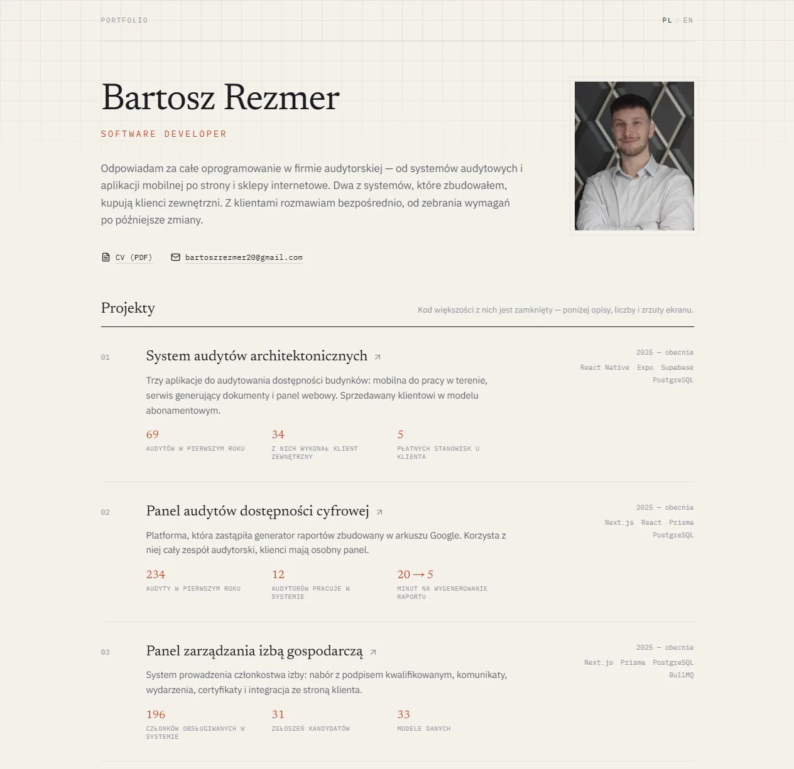

# Portfolio — Bartosz Rezmer

A bilingual portfolio site: case studies of the systems I build for an accessibility-audit company, plus one project of my own. Most of that code is closed-source, so the site shows what can be shown — context, decisions, numbers and screenshots.

**Live:** [portfolio-seven-mocha-34.vercel.app](https://portfolio-seven-mocha-34.vercel.app)



## Why it looks like this

A portfolio for someone whose work sits behind a login is a writing problem before it is a design problem. So every project page follows the same shape — starting point, what I built, outcome — and leads with numbers instead of a feature list. Screenshots carry captions, because a screenshot without one asks the reader to guess what they are looking at, and client data in them is blurred.

## Stack

- **Next.js 16** (App Router, Turbopack) and **React 19**
- **TypeScript**
- **Tailwind CSS 4** — the design system lives as custom properties in `src/app/globals.css`
- Five production dependencies in total. The gallery and the full-screen image viewer are written from scratch, without a lightbox library.

Every page is statically generated: two languages × five projects, plus the two index pages.

## Running it

```bash
npm install
```

```bash
npm run dev
```

Then open `http://localhost:3000` — `/` redirects to `/pl`.

Other scripts: `npm run build` (production build), `npm run start` (serve that build), `npm run lint`.

### Environment

One variable, and it is optional:

| Variable | Purpose | Default |
| --- | --- | --- |
| `NEXT_PUBLIC_SITE_URL` | Base URL for canonical links and metadata | `https://bartoszrezmer.pl` |

Nothing else is needed. There is no database, no API and no CMS.

## Structure

```
src/
  app/
    [locale]/
      layout.tsx              # fonts, <html lang>, metadata
      page.tsx                # home: header + project index
      project/[id]/page.tsx   # case study: metrics, body, gallery
    globals.css               # design tokens
  components/
    gallery.tsx               # thumbnail grid + full-screen viewer
    locale-switch.tsx         # language switch
  data/
    portfolio.ts              # <- all content; the only file to edit
public/
  projects/<project>/*.webp   # screenshots
  cv.pdf, cv-en.pdf, avatar.jpg
```

## Adding a project

Append an object to the `projects` array in `src/data/portfolio.ts`. Nothing outside that file changes — the index entry, the case-study page and the static route all follow from it.

The fields worth filling in deliberately:

- `metrics` — numbers, not feature descriptions. They carry the weight on the index and at the top of the case study.
- `body` — markdown, in this order: starting point → what I built → outcome.
- `images[].caption` — printed under the screenshot and reused as its alt text.
- `liveIsOpen` — `true` only when the link can be clicked and used without logging in. That promotes the button on the page.

## Two languages, one file

The language is a path segment (`/pl`, `/en`) rather than browser state, so any URL can be sent to someone directly and both versions are indexable.

Both translations sit in the same file, and the type enforces it:

```ts
export type L = Record<Locale, string>;
```

A missing translation is a type error, so it cannot ship unnoticed.

## Design system

Warm paper instead of white, deep ink, a single terracotta accent. Newsreader for headings, IBM Plex Sans for body text, IBM Plex Mono for metadata — all loaded with the `latin-ext` subset so Polish diacritics do not fall back to a system font.

Colours and type are defined once, in `@theme` in `globals.css`. Changing the accent across the whole site is one line.

## Accessibility

Written by someone who audits accessibility for a living, so:

- The image viewer is keyboard-operable — `Esc` closes it, arrow keys move between images
- A visible focus outline on interactive elements, via a global `:focus-visible` rule
- Animation is disabled under `prefers-reduced-motion`
- Image alt text comes from the captions

## Deployment

Deployed on Vercel from this repository: push to the default branch and it builds. Nothing to configure beyond the optional variable above.

---

Ta sama treść po polsku: [README.pl.md](README.pl.md)
